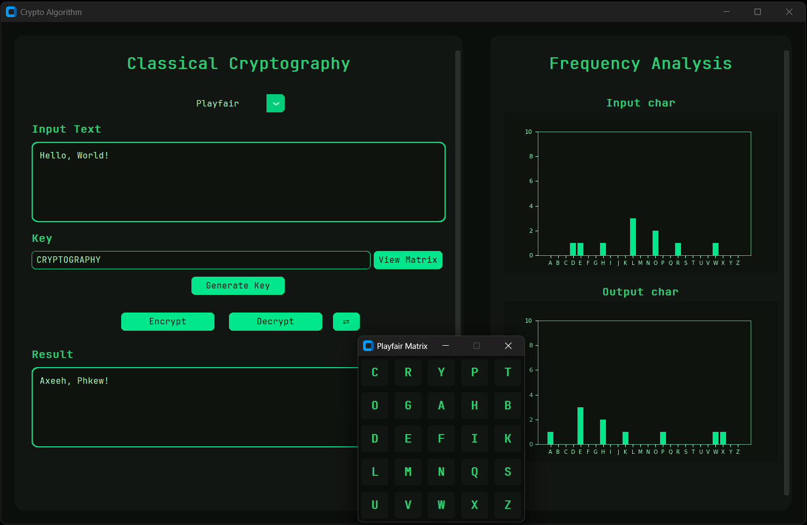

# Classical Cryptography

This is an interactive desktop application developed as part of the Computer Engineering curriculum. 
The project focuses on the implementation and visual analysis of classical cryptographic algorithms, developed as they are introduced in class.

## Overview
This repository contains a project developed for the Information Security course at UFRPE. 
The goal is to implement and visualize classical cryptographic algorithms as they are studied throughout the semester.



> [!TIP]
> You can see the matrix visualization (e.g., Playfair or Hill) and frequency distribution above.

## Installation

### 1. Install dependencies
```bash
pip install -r requirements.txt
```

### 2. Run the application
```bash
python main.py
```

---
Developed by [YannLeao](https://github.com/YannLeao) — *Computer Engineering Student at UFRPE*